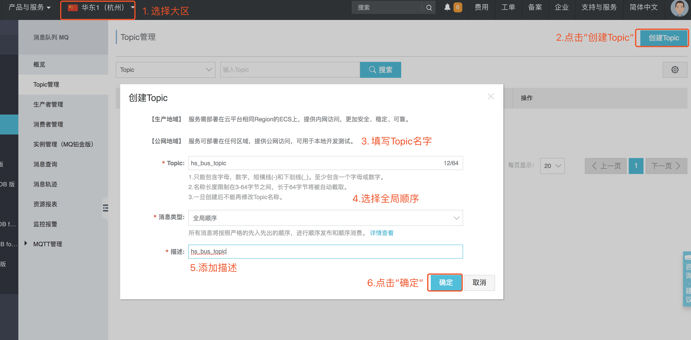
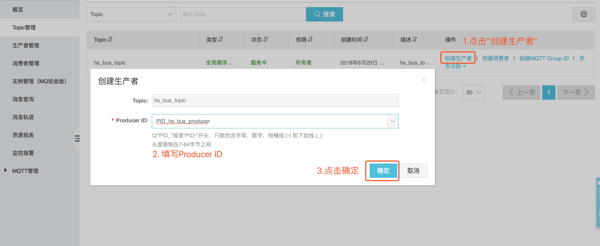
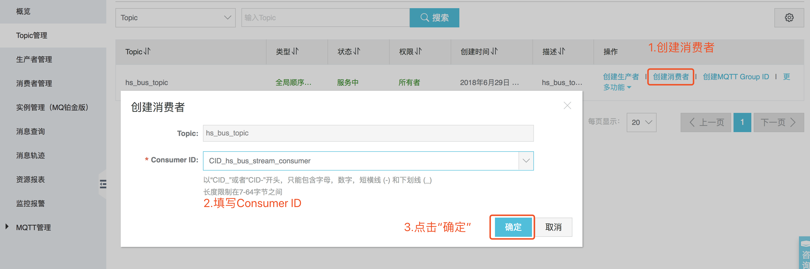
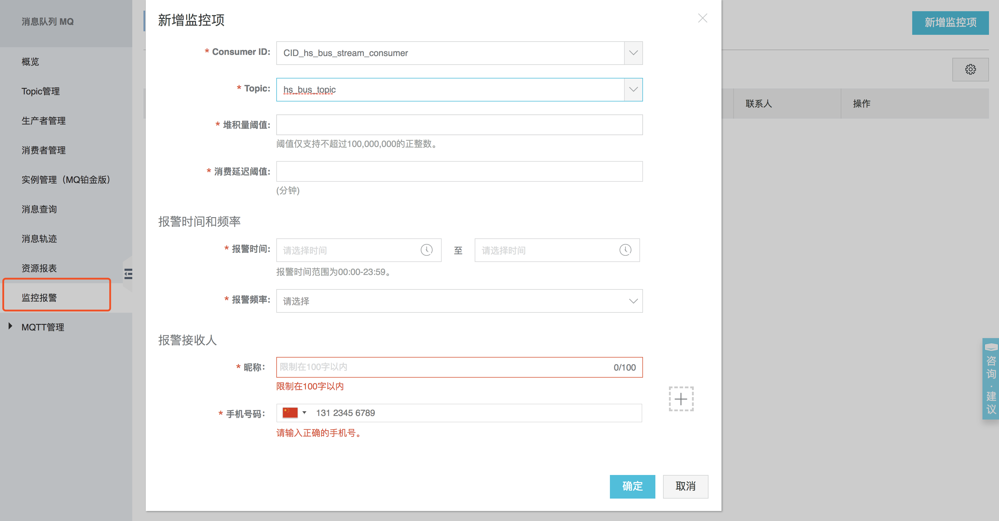

# 华生基因商业数据分析服务后端部署运维文档

## 环境

### 须知

* 以下默认阿里云云服务可用区为`华东1`。
* 以下所有依赖网络的应该在同一局域网中。

### 云服务

#### 云服务器ECS（推荐）

* 镜像：ubuntu16.04
* 实例：计算型 c5
* 存储：SSD 100G（或更高）
* 网络类型：经典网络

#### 云数据库ECS（推荐）

* 版本：MySQL5.7
* 系列：高可用版
* 存储：SSD 100G（或更高）
* 存储类型：本地SSD盘
* 网络类型：经典网络

#### 消息队列（MQ）

* 类型：MQ-按量付费

#### 快递查询

购买地址：https://market.aliyun.com/products/56928004/cmapi014394.html?spm=a2c2e.8906434.0.0.154b1eeacMUXGo

项目配置文件中需用到查询服务的`AppCode`，在阿里云管理后台`云市场`中的`已购买的服务`中可以看到。

## 项目环境搭建

### MQ配置

1. [开通MQ服务](https://www.aliyun.com/product/ons?spm=5176.8142029.388261.417.1c3f6d3e6A06gS)
2. 进入消息队列[管理控制台](https://ons.console.aliyun.com/?spm=5176.7946988.846996.btn5.206425b04aC5LO#/Index?_k=o0zfyx&regionId=mq-internet-access)
3. 创建Topic
    
4. 创建生产者
    
5. 创建消费者
    

### 安装Oracle Java

1. 添加软件源

    sudo add-apt-repository ppa:webupd8team/java
    
2. 更新软件源

    sudo apt-get update
    
3. 安装Oracle Java8

    sudo apt-get install oracle-java8-installer

### 项目配置及编译

#### 修改配置文件

 配置项的相关解释在配置文件中。

 * bus-api项目的配置文件为`bus-api/src/main/resources/application-prod.properties`
 * bus-engine项目的配置文件为`bus-engine/src/main/resources/application-prod.properties`

#### 编译项目

 需在本地编译，依赖Java8和Maven（v3.3.9）。

1. cd到`bus-backend`项目根目录执行`maven package `。
2. 完成后在`bus-api`和`bus-engine`文件夹中的`target`目录下会生成两个jar文件分别是：`bus-api-1.0.jar`和`bus-engine-1.0.jar`。

#### 上传项目

将`bus-api-1.0.jar`和`bus-engine-1.0.jar`拷贝到服务器。

#### 部署项目

1. 导入sql

    连接mysql数据库，并执行后端工程根目录下的`hs_bus.sql`脚本

2. 创建上传文件保存目录
    在系统中找1个位置，创建目录，用于保存上传及导出的历史记录文件

    > 如：/www/hs_bus/
    > 注意：创建的目录距根目录至少2层，否则程序中操作文件时，没有权限
    启动`api`项目时通过指定`sys.kpi.local.path`参数来指定存储文件的目录（默认`/www/hs_bus/`）
    ```
    java -jar bus-api-1.0.jar --spring.profiles.active=prod --sys.kpi.local.path=/www/hs_bus/
    ```

3. 如果已经在`修改配置文件`步骤中将所有的配置项配置完成，那么在jar包所在目录下执行以下命令：

    ```
        java -jar bus-api-1.0.jar --spring.profiles.active=prod --sys.kpi.local.path=/www/hs_bus/
        
        java -jar bus-engine-1.0.jar --spring.profiles.active=prod 
    ```

4. 如果在`修改配置文件`步骤中只配置了基础配置项，那么可以动态修改其他参数，示例为修改端口（默认为8080）和数据库用户名：
    ```
        java -jar bus-api-1.0.jar --spring.profiles.active=prod --server.port=8000 --sys.kpi.local.path=/www/hs_bus/
        
        java -jar bus-engine-1.0.jar --spring.profiles.active=prod --spring.datasource.username=hsgene
    ```

## 项目监控

### API项目监控

提供健康检查接口

- Path：/api/actuator/health
- Method：GET
- Success Code：200
- Failure Code：400、401、404、500

请求示例：

```
GET http://domain.com/api/actuator/health
```

返回成功示例   

```
Header: 
	Content-Type: application/json;charset=utf-8
Body:
	{
        "status": "UP",
        "details": {
            "diskSpace": {
                "status": "UP",
                "details": {
                    "total": 121123069952,
                    "free": 52990783488,
                    "threshold": 10485760
                }
            },
            "db": {
                "status": "UP",
                "details": {
                    "database": "MySQL",
                    "hello": 1
                }
            }
        }
    }
```

返回字段解释：

- status 整体运行状态（UP：正常；DOWN：不正常），各检测项中任何一项为DOWN，整体状态即为DOWN
- details 健康明细
  - diskSpace 磁盘使用信息
    - status 运行状态（UP：正常；DOWN：不正常）
    - details 明细
      - total 总共大小
      - free 空闲大小
      - threshold 阈值；剩余空间小于该值时认为不健康
  - db 数据库连接信息
    - status 运行状态（UP：正常；DOWN：不正常）
    - details 明细
      - database 数据库名称
      - hello 运行是否正常（1：正常；其他：不正常）
      
### Engine项目监控

可使用阿里云消息队列监控报警来监控

